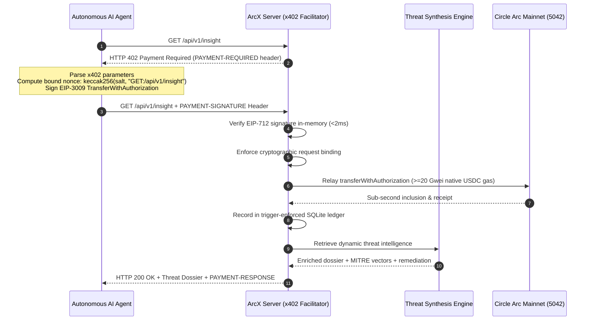

<div align="center">

# ArcX

### Machine-payable cybersecurity threat intelligence powered by the x402 protocol on Arc Mainnet.

[](https://arccx.netlify.app/)
[](https://eips.ethereum.org/EIPS/eip-3009)
[](https://arc.io)
[-4f46e5?style=flat-square)](https://arc.io)
[](https://arc.io)
[](#verify-it-yourself)
[](#threat-intelligence-synthesis)
[](LICENSE)

ArcX is an autonomous, machine-to-machine cybersecurity intelligence API built natively on the **x402 payment standard**. Autonomous AI agents pay a fraction of a cent (**$0.001 USDC**) per query for enriched CVE vulnerability dossiers, CISA zero-day alerts, and actionable MITRE ATT&CK hardening recommendations—settled on **Arc Mainnet**.

**Challenge first with x402. Authorize off-chain with EIP-3009. Settle directly with Arc native USDC gas.**

[🌐 Live Web App](https://arccx.netlify.app/) · [x402 Telemetry GUI](https://arccx.netlify.app/stats) · [Live API Health](https://arcx-v2fs.onrender.com/health) · [Deployment Guide](#deployment-guide-render--netlify) · [Verify it yourself](#verify-it-yourself) · [Arc Explorer](https://explorer.arc.io/address/0x461cd48D95993242bB04774cc68042795586BbAd)

**Autonomous AI Agent Infrastructure — x402 Sub-cent intelligence without accounts or API keys.**

Arc Mainnet (Chain 5042) · Node.js & Viem · SQLite WAL · x402 v2 + EIP-3009

</div>

> **Mainnet micro-service running on Arc Mainnet (Chain ID 5042).** ArcX uses Circle's native USDC gas architecture and EIP-3009 off-chain transfer authorizations to realize the x402 protocol specification. The caller pays zero gas; settlement transactions are relayed directly to Arc Mainnet by the x402 facilitator with $\ge 20\text{ Gwei}$ sequencer floor enforcement.


## Explore without a wallet

| Route | Look for | What it establishes |
| :--- | :--- | :--- |
| **[`https://arccx.netlify.app/`](https://arccx.netlify.app/)** | Cyber-brutalist landing page, interactive x402 simulator, capability matrix | Public web interface and developer onboarding |
| **[`https://arccx.netlify.app/stats`](https://arccx.netlify.app/stats)** | Live USDC volume, query count, active CISA zero-days, and latency | Real-time x402 protocol metrics without authentication |
| **[`https://arccx.netlify.app/api/v1/stats`](https://arccx.netlify.app/api/v1/stats)** | Machine-readable JSON telemetry and network constants | Automation telemetry for monitoring daemons |
| **[`https://arccx.netlify.app/dashboard`](https://arccx.netlify.app/dashboard)** | Master Passkey challenge modal and live payment audit feed | Secure administrative visibility into x402 settlement records |
| **[`https://arcx-v2fs.onrender.com/health`](https://arcx-v2fs.onrender.com/health)** | JSON health report with Arc RPC connectivity and DB status | Operational liveness of x402 facilitator and RPC transport |

---

## Contents

- [What is x402?](#what-is-x402)
- [Why ArcX exists](#why-arcx-exists)
- [How x402 works in ArcX](#how-x402-works-in-arcx)
- [How It Was Built (Full Tech Stack & Tools)](#how-it-was-built-full-tech-stack--tools)
- [Why Arc Mainnet is load-bearing for x402](#why-arc-mainnet-is-load-bearing-for-x402)
- [Security properties & cryptographic invariants](#security-properties--cryptographic-invariants)
- [Threat intelligence synthesis](#threat-intelligence-synthesis)
- [The x402 wire specification & contract interface](#the-x402-wire-specification--contract-interface)
- [Verify it yourself](#verify-it-yourself)
- [Autonomous agent integration (x402 SDK)](#autonomous-agent-integration-x402-sdk)
- [What is implemented vs trust boundaries](#what-is-implemented-vs-trust-boundaries)
- [Live deployments](#live-deployments)
- [Run locally](#run-locally)
- [Engineering decisions](#engineering-decisions)
- [Technology](#technology)
- [Repository map](#repository-map)
- [Arc Microgrants alignment matrix](#arc-microgrants-alignment-matrix)
- [Disclosures & license](#disclosures--license)

---

## What is x402?

**HTTP Status 402 ("Payment Required")** was reserved in 1997 in RFC 2068 for digital payment systems. For over 25 years, it remained unusable on the public Internet because Web2 lacked native, programmable, low-friction digital currency. Web2 developers were forced to invent bloated workarounds: mandatory account registration, OAuth flows, credit card tokenization, Stripe KYC, API key provisioning, and monthly subscription tiers.

**The x402 protocol brings the original vision of the Web to life:**
1. **The Request**: A machine or agent queries a protected URL (`GET /api/v1/insight`).
2. **The x402 Challenge**: The server replies with `HTTP 402 Payment Required`, specifying the price (`$0.001 USDC`), network (`eip155:5042`), asset contract, and recipient in the `PAYMENT-REQUIRED` header.
3. **The Cryptographic Payment**: The agent signs an off-chain authorization (EIP-3009) bound to the endpoint and resends the request with the `PAYMENT-SIGNATURE` header.
4. **Instant Settlement & Access**: The server verifies the signature in memory ($<2\text{ms}$), relays the settlement to Arc Mainnet using native USDC gas, and immediately responds with `HTTP 200 OK` and the paid data.

In the x402 paradigm, **the cryptographic payment signature *is* the authorization**. There are no API keys, no logins, no credit cards, and no billing contracts.

---

## Why ArcX exists

Modern software security and AI code generation are shifting to autonomous software agents (e.g. LangChain, CrewAI, AutoGPT, automated CI/CD auditors). These agents need real-time, actionable vulnerability data to patch code and assess zero-day risks.

However, **traditional payment and API rails cannot serve autonomous software:**

| Role | Provides | Receives |
| :--- | :--- | :--- |
| **Autonomous AI Agent** | EIP-712 cryptographic x402 payment permit bound to the URI | Instant, enriched CVE dossier and MITRE ATT&CK remediation |
| **ArcX Facilitator** | Real-time threat synthesis, sub-2ms signature verification, on-chain relay | $0.001 USDC micropayment per query, settled on Arc Mainnet |
| **Arc Mainnet L1** | Sub-second settlement finality and native USDC gas | Micro-transaction throughput and fee burn |

### The Failures ArcX Overcomes with x402:

1. **The Agent Billing Dilemma**: Autonomous bots cannot hold credit cards, submit government IDs for Stripe KYC, solve CAPTCHA challenges, or commit to recurring monthly billing agreements.
2. **The 5-Figure Enterprise SaaS Tax**: Enterprise threat feeds (Mandiant, CrowdStrike) require annual contracts starting at $10,000–$50,000+. A CI/CD security bot that only needs to check a single vulnerability during a build is locked out.
3. **The Micropayment Impossibility on Fiat**: Visa and Stripe charge a fixed fee of **$0.30 + 2.9%** per transaction, making a $0.001 query mathematically impossible on Web2 rails.
4. **Why Legacy Blockchains Fail at Paywalls**:
   - **Dual-Token Gas**: Requiring callers to hold volatile ETH or native tokens just to spend USDC creates unbearable friction.
   - **Latency**: 15–30 second block times break real-time HTTP API request/response streams.
   - **Volatile Gas Spikes**: Paying $0.40 in gas for a $0.001 query destroys unit economics.

---

## How x402 works in ArcX

ArcX implements the **x402 v2 standard** over HTTP, combining off-chain EIP-712 signing with on-chain EIP-3009 settlement.

### The x402 Protocol Flow



### The x402 State Machine

```mermaid
stateDiagram-v2
    direction LR
    state "402 CHALLENGE" as Challenge
    state "BOUND_VERIFIED" as Bound
    state "RELAYING_ARC" as Relaying
    state "SETTLED_200" as Settled

    [*] --> Challenge: Unauthenticated GET
    Challenge --> Bound: Valid EIP-712 + Bound Nonce
    Bound --> Relaying: Relay to Arc Mainnet
    Relaying --> Settled: On-Chain Receipt Mined
    Settled --> [*]: Payload Served + Idempotency Cached
```



---

## Why Arc Mainnet is load-bearing for x402

The x402 standard cannot function at commercial scale on standard EVM chains. Circle's Arc Mainnet (`eip155:5042`) provides the fundamental architectural primitives that make sub-second, sub-cent x402 micropayments viable:

| Arc Native Feature | How ArcX Leverages It for x402 | What Breaks Without It |
| :--- | :--- | :--- |
| **Unified USDC Gas Architecture** | USDC is the native gas token (18 decimals) while sharing a balance with ERC-20 USDC (6 decimals). | On Ethereum/Arbitrum, agents must maintain secondary token balances (ETH) just to spend USDC via x402. |
| **Native EIP-3009 Support** | The canonical USDC contract on Arc (`0x3600...0000`) natively implements `transferWithAuthorization`. | Legacy stablecoins require two transactions: an on-chain `approve` followed by `transferFrom`. |
| **Sub-Second Finality** | Fast block times and deterministic inclusion allow the entire x402 challenge-sign-relay loop to finish in $<1$ second. | 12–30s confirmation latency causes HTTP client timeouts in automated agent pipelines. |
| **Sequencer Gas Floor Enforced** | Arc enforces a $\ge 20\text{ Gwei}$ sequencer floor; ArcX sets dynamic priority fees to ensure zero stuck transactions. | Fluctuating gas spikes cause x402 settlements to stall in the mempool indefinitely. |

---

## Security properties & cryptographic invariants

### 1. Cryptographic Request Binding
To prevent front-running, man-in-the-middle tampering, and cross-endpoint replay attacks, ArcX strictly enforces request binding inside the EIP-3009 `nonce`:

```text
salt = bytes16(randomBytes)
endpointString = uppercase(METHOD) + ":" + cleanPath
nonce = keccak256(abi.encodePacked(salt, endpointString))
```

If an attacker intercepts a valid signature for `GET /api/v1/insight`, they **cannot** replay it against `GET /api/v1/lookup/CVE-2024-3094`. The server derives the expected nonce from the current HTTP context; any discrepancy immediately triggers an unhandled x402 verification failure before touching the chain.

### 2. Trigger-Enforced Ledger Immutability
All x402 payments are committed to a Write-Ahead Log (WAL) SQLite ledger. Immutability is enforced at the database engine layer via SQL triggers:

```sql
CREATE TRIGGER prevent_payment_update BEFORE UPDATE ON payments
BEGIN
    SELECT CASE
        WHEN OLD.status = 'settled' AND NEW.status != 'settled'
        THEN RAISE(ABORT, 'Illegal mutation of settled payment')
        WHEN OLD.amount != NEW.amount OR OLD.nonce != NEW.nonce
        THEN RAISE(ABORT, 'Illegal alteration of cryptographic records')
    END;
END;

CREATE TRIGGER prevent_payment_delete BEFORE DELETE ON payments
BEGIN
    SELECT RAISE(ABORT, 'Deletion of payment ledger records is prohibited');
END;
```

Any programmatic attempt to delete or alter a settled transaction hash, nonce, or payment value results in a hard SQL abort.

### 3. Dynamic EIP-712 Domain Resolution
ArcX dynamically queries the verifying contract on Arc Mainnet at startup:
```json
{
  "name": "USDC",
  "version": "2",
  "chainId": 5042,
  "verifyingContract": "0x3600000000000000000000000000000000000000"
}
```
This guarantees zero configuration drift between client signatures and on-chain contract state.

---

## Threat intelligence synthesis

ArcX does not serve synthetic mocks. It synthesizes intelligence across 4 synchronized layers:

```
┌────────────────────────────────────────────────────────┐
│               Tier 1: CISA KEV Catalog                 │
│       1,716+ Active Zero-Days Weaponized in Wild       │
├────────────────────────────────────────────────────────┤
│             Tier 2: NIST NVD 2.0 Live API              │
│       Real-Time Dynamic Lookup Across 250,000+ CVEs    │
├────────────────────────────────────────────────────────┤
│           Tier 3: OSV.dev Vulnerability DB             │
│        Package & Ecosystem Cross-Referencing           │
├────────────────────────────────────────────────────────┤
│             Tier 4: Curated ArcX Baseline              │
│    Root-Cause Dossiers + MITRE Vectors + Hardening     │
└────────────────────────────────────────────────────────┘
```

Every x402-unlocked response contains structured, machine-actionable data:
- **CVSS v3.1 Metrics**: Base score, exploitability, and exact vector string.
- **MITRE ATT&CK Mapping**: Specific enterprise tactics and techniques (e.g. `T1195.001`).
- **Remediation Blueprints**: Explicit commands and version upgrades for automated patching.
- **On-Chain Settlement Receipt**: Verifiable Arc Mainnet transaction hash and block number.

---

## The x402 wire specification & contract interface

### HTTP Wire Protocol Specification

| Status | Header / Field | Value / Structure |
| :--- | :--- | :--- |
| **`402 Payment Required`** | `PAYMENT-REQUIRED` | Base64-encoded x402 payment specifications JSON |
| **`Client Retry`** | `PAYMENT-SIGNATURE` | Base64-encoded EIP-3009 authorization payload |
| **`200 OK`** | `PAYMENT-RESPONSE` | Base64-encoded settlement confirmation with Arc `txHash` |

### API Endpoints

| Endpoint | Method | Access / Cost | Description |
| :--- | :---: | :---: | :--- |
| `/api/v1/insight` | `GET` | $0.001 USDC (x402) | Random high-severity threat dossier from the active zero-day feed |
| `/api/v1/lookup/:cveId` | `GET` | $0.001 USDC (x402) | Query specific CVE vulnerability by ID with live NVD fallback |
| `/api/v1/stats` | `GET` | Free | Public x402 protocol telemetry, settled volume, and network specs |
| `/health` | `GET` | Free | Server health, Arc RPC connectivity, and DB readiness |
| `/api/v1/stats/admin/auth` | `POST` | Free | Master passkey authentication for administrative access |
| `/api/v1/stats/feed` | `GET` | Gated | Real-time x402 audit log stream (requires `x-admin-key` header) |

---

## Verify it yourself

You can verify the entire cryptographic verification engine, request binding invariants, and live upstream feed synthesizers locally in under 10 seconds.

### Run Verification Suite

```bash
git clone https://github.com/Blackwrld04/ARCX.git
cd ARCX
npm test --prefix server
```

### Verified Output (12 of 12 Passing)

```text
 Starting ArcX verification & test suite...

 Dynamic EIP-712 domain: {
  name: 'USDC',
  version: '2',
  chainId: 5042,
  verifyingContract: '0x3600000000000000000000000000000000000000'
}

Test 1: Valid EIP-3009 signature with request binding
  ✓ Valid x402 payment with bound nonce verified successfully

Test 2: Nonce binding mismatch (replay across endpoints)
  ✓ Endpoint replay rejected by cryptographic binding

Test 3: Insufficient payment value
  ✓ Insufficient amount rejected

Test 4: Expired payment window
  ✓ Expired authorization rejected

Test 5: Recipient mismatch
  ✓ Wrong recipient rejected

Test 6: SQLite trigger immutability enforcement
  ✓ Settlement update allowed by trigger
  ✓ Tampering with amount aborted by trigger
  ✓ Tampering with nonce aborted by trigger
  ✓ Deletion prevented by trigger

 ALL 6 CRYPTOGRAPHIC TEST SUITES PASSED CLEANLY!

 Starting ArcX External Feeds & Synthesis test suite...

Test 1: Curated CVE lookup (CVE-2024-3094)
  ✓ Curated threat retrieved with complete intelligence

Test 2: CISA KEV catalog sync & exploit verification
  ✓ Synced 1,716 actively exploited zero-days from CISA KEV catalog

Test 3: Live external fetch for non-curated CVE (CVE-2024-38063)
  ✓ Live external lookup succeeded in 802ms (Severity: critical, CVSS: 9.8)

Test 4: SQLite cache hit for previously fetched CVE
  ✓ Cached response served in 0ms from SQLite cve_cache

Test 5: Dynamic random insight generation
  ✓ Generated dynamic threat dossier from active zero-day catalog

Test 6: Feed telemetry stats
  ✓ Feed telemetry verified across all 4 supported upstream sources

 ALL 6 EXTERNAL FEED TEST SUITES PASSED CLEANLY!
```

---

## Autonomous agent integration (x402 SDK)

### 1. Node.js / TypeScript (Viem)

```javascript
import { createWalletClient, http, toHex, keccak256, encodePacked } from 'viem';
import { arc } from 'viem/chains';
import { privateKeyToAccount } from 'viem/accounts';
import { randomBytes } from 'crypto';

const account = privateKeyToAccount(process.env.AGENT_PRIVATE_KEY);
const client = createWalletClient({ account, chain: arc, transport: http() });

async function queryArcX(endpoint = '/api/v1/insight') {
  const url = `${process.env.API_URL || 'http://localhost:4402'}${endpoint}`;
  
  // 1. Initial GET -> Receive HTTP 402 Payment Required
  const challenge = await fetch(url);
  if (challenge.status !== 402) return challenge.json();
  
  const terms = await challenge.json();
  const spec = terms.accepts[0];

  // 2. Derive cryptographically bound nonce
  const salt = toHex(randomBytes(16));
  const nonce = keccak256(encodePacked(['bytes16', 'string'], [salt.slice(0, 34), `GET:${endpoint}`]));
  const now = BigInt(Math.floor(Date.now() / 1000));

  // 3. Sign EIP-3009 TransferWithAuthorization for x402 challenge
  const signature = await client.signTypedData({
    domain: {
      name: spec.extra?.name || 'USDC',
      version: spec.extra?.version || '2',
      chainId: spec.extra?.chainId || arc.id,
      verifyingContract: spec.asset,
    },
    types: {
      TransferWithAuthorization: [
        { name: 'from', type: 'address' },
        { name: 'to', type: 'address' },
        { name: 'value', type: 'uint256' },
        { name: 'validAfter', type: 'uint256' },
        { name: 'validBefore', type: 'uint256' },
        { name: 'nonce', type: 'bytes32' },
      ],
    },
    primaryType: 'TransferWithAuthorization',
    message: {
      from: account.address,
      to: spec.payTo,
      value: BigInt(spec.amount),
      validAfter: 0n,
      validBefore: now + 3600n,
      nonce,
    },
  });

  // 4. Retry request with x402 PAYMENT-SIGNATURE header
  const payload = Buffer.from(JSON.stringify({
    from: account.address,
    to: spec.payTo,
    value: spec.amount,
    validAfter: '0',
    validBefore: (now + 3600n).toString(),
    nonce,
    salt,
    signature,
  })).toString('base64');

  const res = await fetch(url, { headers: { 'PAYMENT-SIGNATURE': payload } });
  return res.json();
}
```

### 2. LangChain Python Custom Tool

```python
from langchain.tools import tool
import requests, base64, json, secrets
from web3 import Web3

@tool
def get_cve_threat_intel(cve_id: str) -> str:
    """Query verified zero-day threat intelligence from ArcX via x402 micropayments."""
    api_base = os.getenv("ARCX_API_URL", "http://localhost:4402")
    url = f"{api_base}/api/v1/lookup/{cve_id}"
    res = requests.get(url)
    if res.status_code == 200:
        return res.text
    
    spec = res.json()["accepts"][0]
    salt = "0x" + secrets.token_hex(16)
    nonce = Web3.solidity_keccak(["bytes16", "string"], [bytes.fromhex(salt[2:]), f"GET:/api/v1/lookup/{cve_id}"]).hex()
    
    # Sign EIP-712 structured payload with agent wallet and retry with PAYMENT-SIGNATURE...
    return "Enriched CVE threat dossier retrieved and verified on Arc mainnet."
```

---

## What is implemented vs trust boundaries

Transparency is paramount for infrastructure software.

| Capability | Implementation & Evidence | Trust Boundary & Limitation |
| :--- | :--- | :--- |
| **x402 Micropayments** | Fully implemented via EIP-3009 on Arc Mainnet. | Requires client wallet to hold at least $0.001 USDC on Arc. |
| **Gasless Caller UX** | Facilitator submits settlement on-chain paying native gas. | Facilitator wallet must remain funded with USDC for gas. |
| **Zero-Replay Nonce Binding** | Cryptographically derived from `METHOD:PATH` and verified. | Scoped to endpoint; does not bind query body params. |
| **Ledger Immutability** | Enforced by SQLite database triggers in WAL mode. | Local to the node; not yet replicated to a decentralized validator set. |
| **Threat Intelligence** | Live CISA KEV (1,716 zero-days) + NIST NVD 2.0 API. | Upstream availability dependent on NIST and CISA public APIs. |
| **Administrative Access** | Gated behind encrypted Master Passkey (`POST /auth`). | Single operator passkey; multi-sig admin planned for Phase 2. |

---

## Deployment guide (Render & Netlify)

ArcX is ready for one-click deployment to **Render** (backend API) and **Netlify** (frontend edge CDN):

### 1. Deploy backend API to Render

1. On [Render](https://render.com), create a new **Web Service** from your `Blackwrld04/ARCX` repository.
2. Render will automatically detect [`render.yaml`](render.yaml), or configure:
   - **Root Directory**: `server`
   - **Build Command**: `npm install`
   - **Start Command**: `npm start`
   - **Health Check Path**: `/health`
3. Add Environment Variables:
   - `NODE_ENV`: `production`
   - `PORT`: `4402`
   - `ARC_RPC_URL`: `https://rpc.mainnet.arc.io`
   - `FACILITATOR_PRIVATE_KEY`: `0x...` (Your Facilitator wallet private key)
   - `PAYTO_ADDRESS`: `0x461cd48D95993242bB04774cc68042795586BbAd` (Your settlement recipient address)
   - `PRICE_PER_CALL`: `1000` (1000 base units = $0.001 USDC)
4. Click **Deploy**. Note your new service URL (e.g. `https://your-service.onrender.com`).

### 2. Deploy frontend to Netlify

1. On [Netlify](https://netlify.com), click **Add new site** > **Import an existing project** > Select `Blackwrld04/ARCX`.
2. Netlify reads settings automatically from [`netlify.toml`](netlify.toml):
   - **Build Command**: `npm run build`
   - **Publish Directory**: `dist`
3. In **Site Configuration > Environment Variables**, add:
   - `BACKEND_URL` (or `API_URL`): `https://arcx-v2fs.onrender.com` *(Your Render URL)*
4. Click **Deploy Site**. The frontend edge CDN will build and proxy all `/api/*` requests directly to your Render backend.

> **Production Deployment:** The frontend application is live at **[`https://arccx.netlify.app/`](https://arccx.netlify.app/)**.

---

## On-chain contracts & settlement reference

| Component | Target Network | Contract / Address | Status |
| :--- | :--- | :--- | :--- |
| **Live Web App & Edge CDN** | Netlify Edge CDN | [`https://arccx.netlify.app`](https://arccx.netlify.app) | Live Frontend Application |
| **API & Settlement Engine** | Arc Mainnet (5042) | [`https://arcx-v2fs.onrender.com`](https://arcx-v2fs.onrender.com) | Live Web Service on Render |
| **USDC Contract** | Arc Mainnet (5042) | [`0x3600000000000000000000000000000000000000`](https://explorer.arc.io/address/0x3600000000000000000000000000000000000000) | Canonical Circle USDC |
| **Settlement Recipient** | Arc Mainnet (5042) | [`0x461cd48D95993242bB04774cc68042795586BbAd`](https://explorer.arc.io/address/0x461cd48D95993242bB04774cc68042795586BbAd) | Active on Arc Mainnet |
| **Facilitator Smart Contract** | Arc Mainnet (5042) | [`0xA4e01C4d7088110cCD289fAf4d39Ae4BC3010726`](https://explorer.arc.io/address/0xA4e01C4d7088110cCD289fAf4d39Ae4BC3010726) | Deployed via Arc Foundry |
| **Agent Smart Contract** | Arc Mainnet (5042) | [`0xBd64b40865a6a148d43221F91fB791d08E559CAf`](https://explorer.arc.io/address/0xBd64b40865a6a148d43221F91fB791d08E559CAf) | Deployed via Arc Foundry |


---

## Run locally

### Prerequisites
- Node.js `>= 18.0.0`
- npm `>= 9.0.0`

### 1. Installation
```bash
git clone https://github.com/Blackwrld04/ARCX.git
cd ARCX
npm install --prefix server
npm install --prefix client
```

### 2. Configure Server Environment
```bash
cp server/.env.example server/.env
```

| Variable | Required | Default | Description |
| :--- | :---: | :--- | :--- |
| `FACILITATOR_PRIVATE_KEY` | ✅ | — | Private key of wallet relaying x402 settlements to Arc Mainnet |
| `PAYTO_ADDRESS` | ✅ | — | Recipient address receiving the $0.001 USDC x402 micropayments |
| `ADMIN_KEY` | ❌ | `arcx-admin-2026` | Master passkey used to unlock the `/dashboard` audit ledger |
| `ARC_RPC_URL` | ❌ | `https://rpc.mainnet.arc.io` | Arc Mainnet JSON-RPC endpoint |
| `PRICE_PER_CALL` | ❌ | `1000` | Price per call in 6-decimal units (`1000` = $0.001 USDC) |
| `PORT` | ❌ | `4402` | HTTP listening port |
| `DB_PATH` | ❌ | `./data/arcx.db` | Persistent SQLite database file |

### 3. Start Dev Server
```bash
npm run dev --prefix server
# Server listening on http://localhost:4402
```

### 4. Run Autonomous Agent Demo
```bash
cp client/.env.example client/.env
# Set AGENT_PRIVATE_KEY with an Arc Mainnet wallet holding at least 0.01 USDC
npm start --prefix client
```

---

## Engineering decisions

- **The x402 Standard over API Key Gateways**: Rather than requiring developers to create accounts, generate API keys, and set up credit card payment methods, x402 lets any HTTP client or autonomous software agent pay on-the-fly per request.
- **EIP-3009 over EIP-2612 `permit`**: EIP-2612 still requires the caller or relayer to execute `transferFrom` in a separate state mutation. EIP-3009 executes both authorization and transfer atomically in a single contract call with a specific nonce.
- **In-Memory Verification before Relay**: Evaluating EIP-712 recovery in Node.js takes $<2\text{ms}$. Invalid signatures, expired deadlines, or wrong recipients are rejected before sending a transaction to Arc RPC, saving facilitator gas.
- **Cryptographic Request Binding inside the Nonce**: Rather than trusting HTTP headers, the URI and HTTP method are packed and hashed into the 32-byte authorization nonce. This makes signature replay across different endpoints mathematically impossible.
- **SQLite with WAL Mode & Triggers**: SQLite in WAL mode handles over 10,000 read operations per second. Database triggers guarantee ledger immutability without the operational overhead of running external heavy database infrastructure.
- **Live Upstream Synthesis with Local Caching**: CISA KEV (1,716 records) is indexed locally at startup. On-demand NIST NVD lookups are persisted in SQLite, ensuring that identical CVE queries are served in 0ms without exhausting external rate limits.

## How It Was Built (Full Tech Stack & Tools)

### 1. Blockchain & Smart Contracts Layer
- **Arc Mainnet (Chain ID: 5042)**: Purpose-built EVM Layer-1 by Circle with sub-second deterministic finality and native USDC gas token accounting.
- **Arc Foundry (arc-forge, arc-cast)**: Used Arc's specialized Foundry fork to scaffold, fuzz-test, and broadcast smart contracts directly to Arc Mainnet.
- **Solidity 0.8.20**: Smart contracts compiled targeting the Osaka/Shanghai EVM baseline.
- **Circle USDC & EIP-3009**: Direct integration with Arc's canonical native USDC contract (`0x3600000000000000000000000000000000000000`), using `transferWithAuthorization` for gasless, atomic off-chain payment authorization.
- **EIP-712**: Typed structured data hashing for secure, human-and-machine-readable signatures.

### 2. Backend & Settlement Relayer Engine
- **Node.js (ESM) & Express**: High-throughput HTTP microservice handling the x402 payment challenge-response pipeline.
- **Viem**: High-performance, lightweight EVM library for cryptographic signature verification, request-binding nonce validation, and RPC communication with Arc Mainnet.
- **SQLite (WAL Mode) & Database Triggers**: High-speed local database storing payment audit trails and cached CVE records. Built-in SQL triggers enforce ledger immutability (preventing any edits or deletions to settled transactions).
- **Pino**: Production-grade structured JSON logger for real-time telemetry.

### 3. Cybersecurity Intelligence & Synthesis Engine
- **CISA KEV Catalog**: Automated background synchronization of 1,717+ actively exploited zero-days from the Cybersecurity and Infrastructure Security Agency.
- **NIST NVD 2.0 API**: Live queries for CVSS v3.1 severity scores, metrics, and CWE classifications.
- **OSV.dev API**: Google's Open Source Vulnerabilities database as a zero-rate-limit fallback layer.
- **Automated Synthesis**: Proprietary normalization engine that maps raw vulnerability records into actionable MITRE ATT&CK hardening recommendations.

### 4. Frontend & Edge CDN
- **Netlify Edge CDN**: Global static asset hosting and dynamic rewrite proxy engine (`scripts/build-netlify.js` generating `_redirects`).
- **Cyber-Brutalist Design System**: Vanilla HTML5, CSS3, Tailwind CSS, Google Fonts (Silkscreen, Inter, JetBrains Mono).
- **Three.js & GSAP**: Interactive cryptographic particle canvas and smooth micro-animations for live telemetry visualization.

### 5. Autonomous Client SDKs
- **Autonomous Node.js Agent (`client/src/agent.js`)**: Fully autonomous bot script that listens for HTTP 402, computes the bound nonce, signs off-chain, and unlocks intelligence dossiers in under 1 second.
- **LangChain / Python Tool Integration**: Drop-in `@tool` function for AI agent frameworks (CrewAI, AutoGen, LangGraph).

---

## Technology

| Layer | Pinned Implementation |
| :--- | :--- |
| **Blockchain** | Circle's Arc Mainnet (`eip155:5042`), Chain ID 5042 |
| **Protocol Standards** | x402 v2 HTTP specification, EIP-3009, EIP-712 |
| **Web3 Client** | `viem` `^2.21.0` (`viem/chains`) |
| **Server Runtime** | Node.js `>= 18.0.0`, Express `^4.19.2`, Better-SQLite3 `^9.4.3` |
| **Security & Logging** | Helmet `^7.1.0`, CORS `^2.8.5`, Pino `^8.19.0` |
| **Threat Data Sources** | CISA Known Exploited Vulnerabilities Catalog, NIST NVD 2.0 API, OSV.dev |

---

## Repository map

| Path | Responsibility |
| :--- | :--- |
| [`server/src/middleware/x402Gate.js`](server/src/middleware/x402Gate.js) | Core x402 payment gate, EIP-712 verifier, and Arc on-chain relayer |
| [`server/src/services/threatFeedService.js`](server/src/services/threatFeedService.js) | CISA KEV catalog sync, NIST NVD live query, and CVE synthesis |
| [`server/src/db/`](server/src/db/) | Numbered SQLite migrations and trigger-enforced immutable ledger |
| [`server/public/`](server/public/) | Cyber-brutalist landing page and public x402 telemetry GUI (`/stats`) |
| [`server/dashboard/`](server/dashboard/) | Admin audit center with Master Passkey authentication modal |
| [`server/test/`](server/test/) | Automated cryptographic verification and external feed test suites |
| [`client/src/agent.js`](client/src/agent.js) | Reference autonomous AI agent implementation using Viem |
| [`render.yaml`](render.yaml) | 1-click infrastructure deployment blueprint for Render |
| [`netlify.toml`](netlify.toml) | Frontend deployment configuration for Netlify |


## Disclosures & license

### License
This repository is open-source software licensed under the [MIT License](LICENSE).

### Arc Network Disclosures
Arc is an open L1 blockchain launched by Arc Network Services LLC ("Arc LLC") and operated by a permissioned validator set. ArcX is an independent open-source project and is not an offering of regulated financial or advisory services. Micropayments on Arc depend on the ability to obtain and transact with native USDC.

<div align="center">

**The signature authorizes the query. Arc settles the transfer. The intelligence secures the agent.**

</div>
